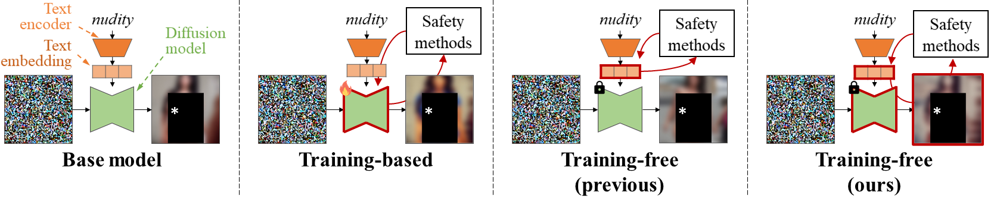

# Training-Free Safe Text Embedding Guidance for Text-to-Image Diffusion Models (STG) (NeurIPS 2025)

| [paper](https://arxiv.org/abs/2510.24012) | [openreview](https://openreview.net/forum?id=fbDHv2LQZJ) | [code](https://github.com/aailab-kaist/STG) | [poster, slide, video](https://neurips.cc/virtual/2025/loc/san-diego/poster/116830) |

--------------------

This repository contains the official PyTorch implementation of **Training-Free Safe Text Embedding Guidance (STG)** in **[NeurIPS 2025](https://neurips.cc/Conferences/2025)**.

**[Byeonghu Na](https://sites.google.com/view/byeonghu-na), [Mina Kang](https://aai.kaist.ac.kr/bbs/board.php?bo_table=sub2_1&wr_id=25), [Jiseok Kwak](https://aai.kaist.ac.kr/bbs/board.php?bo_table=sub2_1&wr_id=26), [Minsang Park](https://aai.kaist.ac.kr/bbs/board.php?bo_table=sub2_1&wr_id=17), [Jiwoo Shin](https://jiwooshin-kr.github.io/), [SeJoon Jun](https://www.linkedin.com/in/sejoon-jun-5531391b2), [Gayoung Lee](https://sites.google.com/site/gylee1103),  [Jin-Hwa Kim](https://wityworks.com/), and [Il-Chul Moon](https://aai.kaist.ac.kr/bbs/board.php?bo_table=sub2_1&wr_id=3)**

**KAIST, NAVER AI Lab, SNU AIIS, summary.ai**

--------------------

**Safe Text embedding Guidance (STG)** is a training-free text embedding guidance method designed to improve safety in text-to-image diffusion models.



---

## Setup

We utilized CUDA 11.4 on a single NVIDIA A100 GPU.

   ```bash
   pip install -r requirements.txt
   ```

## Sampling

### Without STG
```.python
python generate_duo.py <arguments>
```
#### Base arguments
  - `--steps`: Number of sampling steps (integer)
  - `--scheduler`: Scheduler type (e.g., `DDIM`, `DDPM`)
  - `--save_path`: Directory for generated images (a subdirectory named by `--name` is created)
  - `--bs`: Batch size (integer)
  - `--w`: Classifier-free guidance scale
  - `--ver_sd`: Stable Diffusion version (`1.4` or `1.5`)
  - `--text_path`: Path to CSV file containing prompt text corresponding to the images
  - `--max_cnt`: Maximum number of images to generate (integer)
  - `--name`: Experiment name (used to create the image storage folder)

#### DUO-specific arguments
  - `--exp_type`: DUO experiment type (`base` for no DUO, `violence` or `nudity` for DUO mode)  
  - `--unlearn_model_path`: Directory containing DUO unlearned LoRA tensors  

### With STG
```.python
python generate_duo_stg.py <arguments>
```

- Base arguments: same as in the **Without STG** section.
- DUO-specific arguments: same as in the **Without STG** section.

#### STG-specific arguments
  - `--update_intervals`: Range of sampling steps for applying STG. Defined as a string `"start-end"`, where `start` and `end` are integers (e.g., `"5-45"`). Cannot be used with `--update_itrs`.
  - `--update_itrs`: Explicit list of sampling steps for applying STG. Defined as a string of step numbers connected by `-` (e.g., `"20-21-22-23-24"`). Cannot be used with `--update_intervals`.
  - `--update_freq`: Frequency of sampling steps for applying STG. Defined as an integer, applying updates uniformly every `update_freq` steps. Only used if `--update_intervals` and `--update_itrs` are not specified.
  - `--lr_upt_prompt`: Scale hyperparameter for text embedding updates. (float)
  - `--weight_prior`: Strength of L2 regularization loss that preserves the original text embedding. (float)
  - `--unsafe_conf`: Minimum confidence threshold used in the evaluation function. (float)

### Examples
* Generate images with **SD v1.4**, 50 steps DDIM sampler, on Ring-A-Bell prompts 
```.python
python generate_duo.py --steps=50 --scheduler=DDIM --save_path=gen_safe --bs=4 --w=7.5 --ver_sd=1.4 --text_path=prompts/subset_ringabell.csv --max_cnt=5000 --name=ringabell_base
```

* Generate images with **SD v1.4 + STG**, 50 steps DDIM sampler, on Ring-A-Bell prompts 
```.python
python generate_duo_stg.py --steps=50 --scheduler=DDIM --save_path=gen_safe --bs=4 --w=7.5 --ver_sd=1.4 --update_intervals=5-45 --lr_upt_prompt=0.5 --weight_prior=0 --unsafe_conf=0.01 --text_path=prompts/subset_ringabell.csv --max_cnt=5000 --name=ringabell_stg
```

* Generate images with **SD v1.4 + DUO**, 50 steps DDIM sampler, on Ring-A-Bell prompts 
```.python
python generate_duo.py --steps=50 --scheduler=DDIM --save_path=gen_safe --bs=4 --w=7.5 --ver_sd=1.4 --text_path=prompts/subset_ringabell.csv --max_cnt=5000 --exp_type=nudity --unlearn_model_path=checkpoints --name=ringabell_duo
```

* Generate images with **SD v1.4 + DUO + STG**, 50 steps DDIM sampler, on Ring-A-Bell prompts 
```.python
python generate_duo_stg.py --steps=50 --scheduler=DDIM --save_path=gen_safe --bs=4 --w=7.5 --ver_sd=1.4 --update_intervals=20-30 --lr_upt_prompt=0.5 --weight_prior=0 --unsafe_conf=0.01 --text_path=prompts/subset_ringabell.csv --max_cnt=5000 --exp_type=nudity --unlearn_model_path=checkpoints  --name=ringabell_duo_stg
```


## Evaluation

### Defense success rate (DSR)
```.python
python evaluation/nudity_detector.py --img_path=<directory_of_generated_images> --nudenet_path=<path_of_nudnet_checkpoint>
```
- `--img_path`: The directory containing generated images 
- `--nudenet_path `: The path to the NudeNet model checkpoint


### Prior preservation (1-LPIPS)
```.python
python evaluation/calc_lpips.py --dir0=<directory_of_base_images> --dir1=<directory_of_generated_images>
```
- `--dir0`: The directory containing (generated) images to compare with the images in `img_path`
- `--dir1`: The directory containing generated images 


### Zero-shot FID
```.python
python evalution/fid.py <directory_of_generated_images> <path_of_coco_npz_file> --num_eval=3000
```
- `<directory_of_generated_images>`: The directory containing generated images  
- `<path_of_coco_npz_file>`: The path to the `coco.npz` FID stats file  
- `--num_eval`: The number of images to be evaluated for FID

### CLIP score
```.python
python evaluation/eval_clip_score.py --text_path=<path_of_csv_prompt_file> --img_path=<directory_of_generated_images> --bs=100 --num_eval=3000
```
- `--text_path`: The path to a CSV file containing prompt text corresponding to the images
- `--img_path`: The directory containing generated images 
- `--bs`: The batch size for evaluation  
- `--num_eval`: The number of images to be evaluated for FID

### ImageReward
```.python
python evaluation/image_reward.py --text_path=<path_of_csv_prompt_file> --img_path=<directory_of_generated_images> --bs=100 --num_eval=3000
```
- `--text_path`: The path to a CSV file containing prompt text corresponding to the images
- `--img_path`: The directory containing generated images 
- `--bs`: The batch size for evaluation  
- `--num_eval`: The number of images to be evaluated for FID


## Acknowledgements

This codebase builds upon and is inspired by:

- **Diffusers**: https://github.com/huggingface/diffusers

- **DUO**: https://github.com/naver-ai/DUO

- **DATE**: https://github.com/aailab-kaist/DATE

## Citation

```bibtex
@inproceedings{
na2025trainingfree,
title={Training-Free Safe Text Embedding Guidance for Text-to-Image Diffusion Models},
author={Byeonghu Na and Mina Kang and Jiseok Kwak and Minsang Park and Jiwoo Shin and SeJoon Jun and Gayoung Lee and Jin-Hwa Kim and Il-chul Moon},
booktitle={The Thirty-ninth Annual Conference on Neural Information Processing Systems},
year={2025},
url={https://openreview.net/forum?id=fbDHv2LQZJ}
}
```
